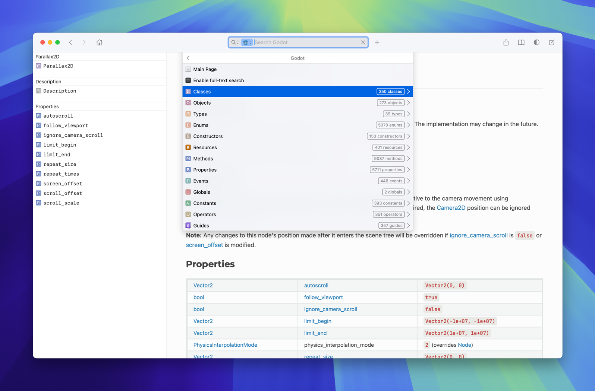

# Godot 4.x Dash Docset Generator

This is tool to generate a Dash docset for Godot 4.x.

## Dash [entry type][2] mappings

The following table shows the mapping of the Dash entry types to the corresponding types used in the Godot 
documentation.

| Dash Entry Type | Godot Documentation                  |
|:----------------|:-------------------------------------|
| Class           | Node                                 |
| Object          | Other classes (RenderingServer, etc) |
| Resource        | Resource                             |
| Type            | Core types (float), variants, etc    | 
| Event           | Signal                               |
| Enum            | Enum                                 |
| Constant        | Constant                             |
| Guide           | Tutorial                             |

For example, when you see a `Class` entry in Dash, it corresponds to all types derived from `Node` in the Godot 
documentation:



## Usage

### Build the `godotdash` binary

 ```sh
 CGO_CFLAGS=-DSQLITE_MAX_VARIABLE_NUMBER=100000 go build
 ```


### Generating the docset

1. Download a ZIP archive of the [Godot 4.x documentation][1] for offline use (stable or latest)
2. Extract the ZIP archive to a folder
3. Create a new folder called `Godot.docset` for the docset
4. Copy the contents of the extracted folder to `Godot.docset/Contents/Resources/Documents`
5. Run `godotdash` to generate the index and update the HTML files:

    ```sh
   godotdash --docs-path=<path to extracted zip> \
     --docset-path=<path to>/Godot.docset
    ```
6. Add the docset to Dash

[1]: https://github.com/godotengine/godot-docs?tab=readme-ov-file#download-for-offline-use
[2]: https://kapeli.com/docsets#supportedentrytypes

## Credits

Using dashtoc3 format based:

* [Kapeli's Comment](https://github.com/Kapeli/Dash-User-Contributions/issues/3015#issuecomment-708226890)
* Reverse engineering other docsets
